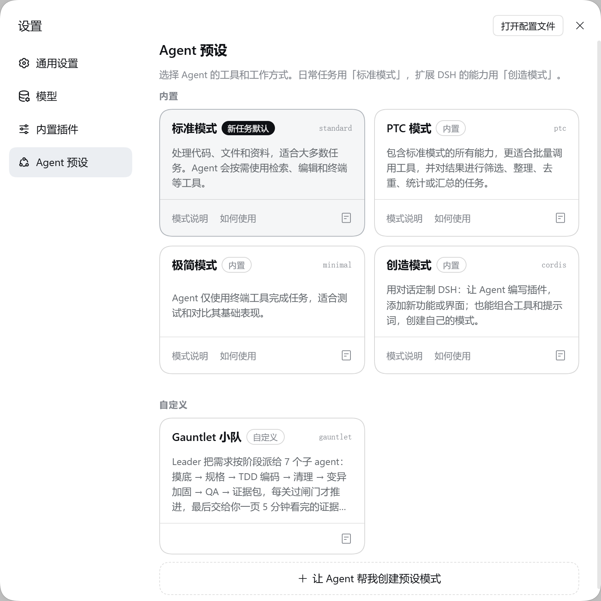
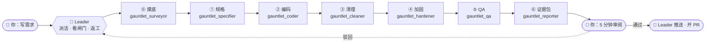
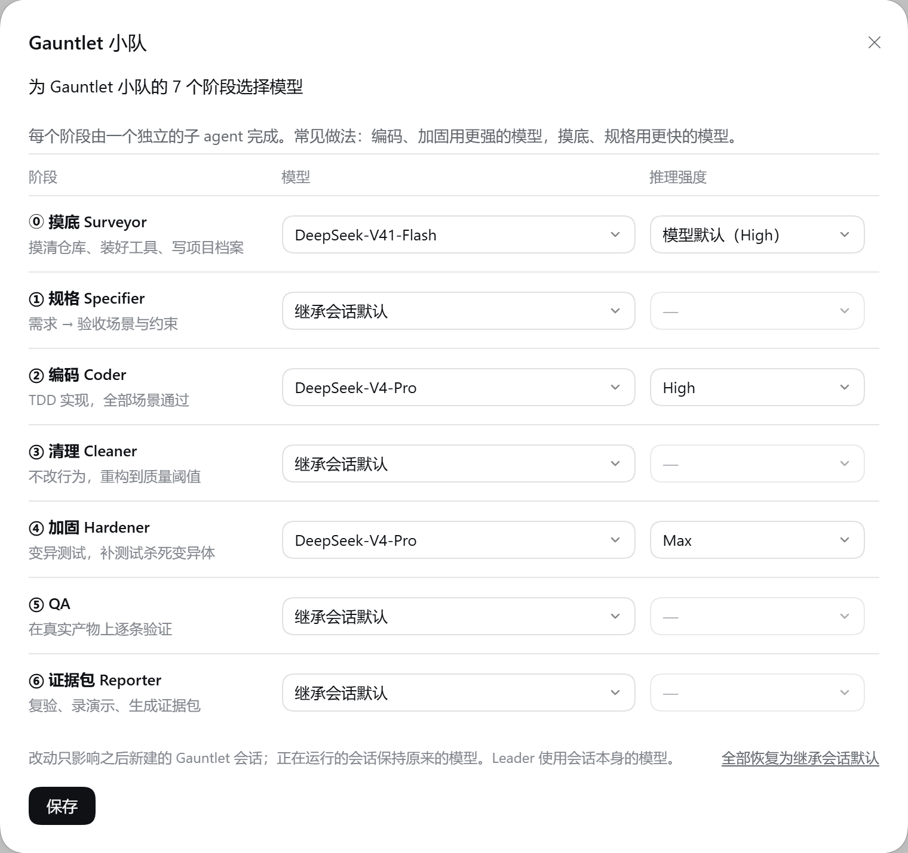

<h1 align="center">Gauntlet · dsh-crap-agents</h1>

<p align="center">
  <b>DeepSeek Harness 插件：让一支 AI 小队按 Bob 大叔的方法写代码——<br>
  需求 → 验收测试 → TDD → 全量代码质量 → 变异测试 → QA，最后交给你一页 5 分钟看完的证据包。</b>
</p>

<p align="center">
  
  
  
  
  
</p>

> **人不读 AI 写的代码，人读证据。**
> 与其逐行审查，不如把 agent 关进一层层**可度量的闸门**：每个 agent 只做一件事，做完就把证据交出来；
> 人只负责定需求、画边界、看最后的证据。

这是 [multica-crap-agents](https://github.com/Iamtianyuyang/multica-crap-agents) 移植到 **DeepSeek Harness（dsh）** 的插件版本：
同一条流水线、同一套零依赖工具和离线证据包，做成 dsh 的一个 **Agent 预设（模式）**，用 dsh 的技能和子代理（subagent）来组队。

## 安装

```bash
dsh plugin --profile web add github:Iamtianyuyang/dsh-crap-agents
```

然后重启 `dsh web` 并刷新页面；`dsh plugin --profile web list` 里会出现 `dsh-gauntlet`。
用桌面版 DeepSeek Harness 的话，把 `--profile web` 换成 `--profile desktop`，装完重启应用。
本地开发：在仓库目录里 `dsh plugin --profile web add "link:$(pwd)"`，改完刷新即可。

> 需要目标机器有 git、Node 18.17+（dsh 自带的 runtime 已满足），以及项目自己平时构建 / 测试用的工具。

装好后会得到：

- **「Gauntlet 小队」模式**：在 Agent 预设的「自定义」分组里。新建任务时选它，主会话 agent 就是 Leader；
  其他模式（标准、PTC……）完全不受影响——小队的技能和工具只存在于这个模式里。
- **「Gauntlet 小队」设置页**：给 7 个阶段分别选模型。两个入口：Gauntlet 模式下输入框左下角的「阶段模型」按钮（悬浮窗），
  或侧栏「插件」→「已安装」→ dsh-gauntlet。
- **「流程进度」面板**：Gauntlet 主会话里自动显示 7 个阶段的当前状态；点击任一阶段，查看任务、闸门和结果详情。
- **环境变量 `DSH_GAUNTLET_KIT_DIR`**：Gauntlet 会话里的每次 shell 调用都能拿到，指向插件自带的零依赖工具本体，
  一行把 `.gauntlet/` 装进目标仓库（离线）。

<p align="center">
  
  <br><sub>设置 → Agent 预设：「Gauntlet 小队」在「自定义」分组里，和内置模式并列</sub>
</p>

## 这支小队怎么组成的

选了「Gauntlet 小队」模式的会话里，主会话 agent 是 **Leader（编排者）**：它的系统提示就是编排协议（[`prompts/leader.md`](prompts/leader.md)）。
它把需求**按阶段派给 7 个阶段子 agent**；每个子 agent 在同一个工作目录（目标仓库）里干自己那一个阶段，
跑完对应闸门、把证据交回来，Leader 过关才推进，不过就返工。



| 阶段 | 子代理工具 | 阶段技能 | 必须通过的闸门 |
|---|---|---|---|
| ⓪ 摸底 | `gauntlet_surveyor` | `gauntlet-survey` | `doctor` 全绿、`test` 跑完、写好 `GAUNTLET.md` |
| ① 规格 | `gauntlet_specifier` | `gauntlet-specify` | `gate --profile specifier` |
| ② 编码 | `gauntlet_coder` | `gauntlet-tdd` | `gate --profile coder` |
| ③ 清理 | `gauntlet_cleaner` | `gauntlet-clean` | `gate --profile cleaner` |
| ④ 加固 | `gauntlet_hardener` | `gauntlet-harden` | `gate --profile hardener` |
| ⑤ QA | `gauntlet_qa` | `gauntlet-qa` | QA 报告全部通过 |
| ⑥ 证据包 | `gauntlet_reporter` | `gauntlet-report` | `gate --profile full` |

每个阶段子 agent 先读共同规则 `gauntlet-core`，再按项目 `gauntlet.config.json` 的 `adapter`
读一个工具链片段（`gauntlet-adapter-commands` 通用 / `gauntlet-adapter-cmake` 深度分析）。

几条贯穿全程的规矩：

- **子 agent 不需要你的审批。** dsh 里被委派的子 agent 碰到需要审批的操作会被自动拒绝；Gauntlet 的阶段 agent
  遇到这种情况（缺工具、要联网下载……）会把**确切的命令**交回 Leader，Leader 拿给你批准后代为执行，再让那个阶段重来。
- **推送和 PR 在你说"通过"之后。** 证据包阶段只在本地分支提交；你审阅通过，Leader 才 `git push` 并开 PR。被驳回的工作不会被推送。
- **进度不靠记忆。** Leader 用 todo 列表和 git 提交（带 `[code]`、`[clean]` 等阶段标签）记进度；子 agent 每次测试变绿就提交。
  某个阶段被中断（取消、撞到 token 上限、dsh 重启）时，Leader 会让它从仓库现状继续，而不是当作失败。

## 流程进度

「Gauntlet 小队」主会话右侧的面板把流水线画成一条竖向时间线，可从会话顶部的「流程」按钮打开：Leader、七个阶段和三处人类闸门（◇ 确认摸底、可选的确认规格、最终审阅证据包）依次排在轨道上。每个阶段写明要通过的闸门（如 `gate · coder`），跑过之后换成最近一次的逐项结果（`✓spec ✓build ✗tests 23/25`）；同一阶段做过多次时行尾用小圆点标出每次结果。退回更早阶段的返工画成轨道左侧的回流箭头，下方「返工记录」逐条写明谁退回给谁、原因（取自 Leader 派活时的「返工说明」，没有时列出上一轮失败的闸门）。有阶段在等用户时，顶部出现「需要你处理」说明在等什么。顶部固定显示当前执行位置、下一阶段和已通过数量。支持宿主的拖动调宽、关闭和全屏。
状态随阶段工具调用和 `GAUNTLET-RESULT` 更新，显示当前执行阶段和已通过数量；Leader 在阶段之间处理工作时会单独说明，尚未派发的阶段显示为「下一阶段」。
阶段状态包括未开始、进行中、已通过、需返工、等待确认、已中断、待核实和需重跑；需要用户确认时，Leader 的进度记录会说明在等什么。

点击已派过活的阶段，面板整页切到该阶段的详情，「← 流程」返回并回到原来的滚动位置。详情直接展开闸门结果、结论（摘要、分支、收敛记录、后续提示）、全部尝试（每次的状态、失败的闸门，以及「同阶段重做 / 由 QA 退回 / 中断后继续」和原因）和质量指标；派发任务、子 agent 的发言与工具调用、完整返回内容放在最后的「原始记录」折叠里。

面板的「参数」页可编辑 CRAP、函数复杂度、函数行数、参数数、行覆盖率、变异杀死率等 12 项质量阈值，以及每个阶段的模型和推理强度。质量阈值保存到会话项目的 `gauntlet.local.json`，仅修改编辑过的字段并保留其他配置；文件在别处更新时会提示冲突。质量改动供之后的工具运行读取，模型改动用于之后新建的 Gauntlet 会话。

质量参数使用会话的项目根目录。如果会话从子目录打开、配置位于父级项目目录，面板会提示以项目根目录打开后编辑，避免生成工具不会读取的本地配置。
记录可折叠但不会截断；可以加载更早的子会话记录，或直接打开原子会话。回退重做后，下游阶段的旧结果会标成「需重跑」。
会话历史未完整加载时，面板会注明；可点「加载更早记录」补齐前面的执行详情。

函数详情提供搜索，分别展示 AST / 覆盖率分支复杂度、行覆盖率、CRAP 风险值和变异杀死率，并保留每个变异体、测试、QA、阈值和原始报告。函数变异分数按源码行范围汇总，会注明推导方式；缺少数据时显示「未测量」。
阶段结束后，插件在 `gauntlet-out/workflow/<callId>/reports.json` 保存当时的指标快照（界面关闭也会保存）。旧执行没有快照时明确说明，不用后续阶段的报告冒充历史数据。面板底部也可查看注明来源的工作区最新报告。
快照单个报告限制 4 MiB、整体限制 16 MiB；超限或读取失败会保留错误说明。前台阶段执行才记录完成快照，后台启动确认不视为完成。

## 每个阶段自己选模型

在 Gauntlet 模式的输入框里点「阶段模型」按钮（只在这个模式下出现），或者打开侧栏「插件」→「已安装」→ dsh-gauntlet：
7 个阶段各一行，选模型和推理强度，保存。按钮上会显示有几个阶段用了自定义模型。

<p align="center">
  
  <br><sub>「阶段模型」悬浮窗：例如摸底用 Flash，编码 / 加固用 V4-Pro 并调高推理强度，其余继承会话默认</sub>
</p>

- 「继承会话默认」→ 用会话本身的模型（Leader 始终用会话模型）。
- 下拉框里只有当前真正可用的模型；以前保存的模型不再可用时会单独列在「已保存但当前不可用」里，提醒你换掉。
- 改动只影响**之后新建**的 Gauntlet 会话；正在跑的会话保持原来的模型。
- 常见做法：编码 / 加固用更强的模型，摸底 / 规格用更快的模型。

不用界面也可以：写进 profile 的 `cordis.patch.yml`（会替换 `gauntlet` 这一行的整份配置）：

```yaml
- id: gauntlet
  name: dsh-gauntlet
  config:
    stages:
      coder:    { provider: deepseek, model: deepseek-reasoner, reasoningEffort: high }
      hardener: { provider: deepseek, model: deepseek-reasoner }
```

阶段 key：`surveyor` `specifier` `coder` `cleaner` `hardener` `qa` `reporter`。

## 用起来

把目标仓库在 dsh 里打开，新建任务时选「Gauntlet 小队」模式，然后直接说需求，例如：

> 做一个命令行工具，在阿拉伯数字和罗马数字之间互相转换……

Leader 会：建工作分支，先让 `gauntlet_surveyor` 摸底并（第一次接入仓库时）停下来请你确认规则，再依次走规格、编码、清理、加固、QA，
最后 `gauntlet_reporter` 生成**单文件离线证据包** `gauntlet-out/evidence/index.html` 交给你审阅。你回复"通过"后，Leader 推送分支并开 PR。

### Windows 上的三个 shell

| 谁执行命令 | Windows | Linux / macOS |
|---|---|---|
| agent 自己（shell 工具） | PowerShell | bash |
| `gauntlet.config.json` 的 `commands` | cmd.exe | /bin/sh |
| `demo/*.json` 的 `run` | Git Bash | /bin/sh |

技能里的命令都写成一行的 `node .gauntlet/gauntlet.mjs …` / `git …`，在哪个 shell 里都一样；平台相关的逻辑都在 kit 里
（例如 QA 用的 `leak-check` 代替了只能在 POSIX 下用的 `find -newer`）。

### 本地先体验工具（不进 dsh）

`examples/bowling-js`（Bob 大叔的保龄球计分 kata）只需要 Node 18.17+：

```bash
cd examples/bowling-js
node ../../kit/gauntlet.mjs gate --profile full
node ../../kit/gauntlet.mjs evidence --title "保龄球计分"
```

然后打开 `gauntlet-out/evidence/index.html`。`examples/roman-kata` 是同一条流水线在「CMake + clang 深度分析」下的样子。

## 接入任何项目

闸门不认识任何语言、编译器或框架，只认识**标准报告**（JUnit、LCOV/Cobertura、SARIF、编译器告警）。
项目在 `gauntlet.config.json` 的 `commands` 里写自己平时怎么构建、怎么测试、怎么检查；摸底阶段（`gauntlet_surveyor`）
会实际跑通并写进项目档案 `GAUNTLET.md`。默认质量标准、棘轮模式（旧代码只收紧不放松）、配置项等细节见
各技能和 [`kit/`](kit) 工具，用法都是 `node .gauntlet/gauntlet.mjs <命令>`。

## 开发

- **`kit/` 不在本仓库里直接修改。** 它是上游 multica-crap-agents 的 kit 的副本：改动先做到上游，再同步过来：

  ```bash
  node scripts/sync-kit.mjs ../multica-crap-agents
  ```

  `kit/.sync.json` 记录上次同步时每个文件的哈希；本仓库的 `kit/` 被直接改过时，同步会拒绝并列出文件。
  `kit/install-kit.mjs` 是本插件独有的，同步时保留。
- **preset 是照 dsh 的 `standard` 模式抄的**（去掉了计划模式和通用委派工具）。升级 dsh 时对照新版 `dsh-web-app/presets/standard.patch.yml`
  更新 [`lib/preset.js`](lib/preset.js)，并同步改 `package.json` 里锁定的 dsh 版本。
- 设置页和流程进度面板 [`lib/client.js`](lib/client.js) 是手写的 dsh 客户端模块，没有构建步骤；阶段 key 要和 [`lib/stages.js`](lib/stages.js) 一致。

## 仓库结构

```text
package.json             dsh 插件清单（dsh.bundle.patch / dsh.client / dsh.install / dshTarget）
cordis.patch.yml         bundle patch：只挂插件服务这一行（id: gauntlet）
lib/index.js             Cordis 插件入口：声明 preset、每阶段模型配置、DSH_GAUNTLET_KIT_DIR
lib/preset.js            「Gauntlet 小队」preset 的组成（基于 dsh standard 模式）
lib/stages.js            7 个阶段子 agent：工具名、技能、persona
lib/client.js            客户端界面：阶段模型设置 + 主会话流程进度与阶段详情
prompts/leader.md        Leader 的编排协议（就是 Leader 的系统提示）
skills/gauntlet-*/       10 个技能：共同规则 + 每个阶段做什么 + 两个工具链片段（只在这个模式里注册）
kit/                     Gauntlet 工具本体（零依赖 Node ESM，从上游同步）+ install-kit.mjs
scripts/sync-kit.mjs     从上游同步 kit/
examples/bowling-js/     通用方式示例（JavaScript，零依赖）
examples/roman-kata/     CMake + clang 深度分析示例（C++），含录像、教程、架构图
```

## 从 1.x 升级

2.0 不兼容 1.x：

- 7 个阶段工具不再挂在所有会话上，只在「Gauntlet 小队」模式里；`gauntlet-leader` 技能删除了（协议变成 Leader 模式的系统提示）。
- 环境变量 `GAUNTLET_KIT_DIR` 改名为 `DSH_GAUNTLET_KIT_DIR`，只在 Gauntlet 会话里提供。
- profile patch 里针对 `gauntlet-coder` 等行的 `agentOptions` 覆盖不再生效：改到设置页，或写进 `gauntlet` 行的 `stages`（见上）。
- 阶段工具不再支持每次派活时临时选模型（`modelSelectionSettings`）：7 个工具同时开启会让会话无法创建。

## 致谢

- **Robert C. Martin（Bob 大叔）**：验收测试即需求、TDD、CRAP、变异测试、"不读 AI 的代码，读证据"的整套思路。
- **[DeepSeek Harness](https://github.com/deepseek-ai/deepseek-harness)**：Cordis 插件体系、Agent 预设、技能子系统与子代理机制，让这支小队能装进来自动跑。
- **[multica-crap-agents](https://github.com/Iamtianyuyang/multica-crap-agents)**：本插件的上游（Multica 版）。
- **[Archify](https://github.com/tt-a1i/archify)**、**[lizard](https://github.com/terryyin/lizard)**、**[Stryker mutation-testing-elements](https://github.com/stryker-mutator/mutation-testing-elements)**：架构图、多语言复杂度分析、通用变异测试报告格式。
